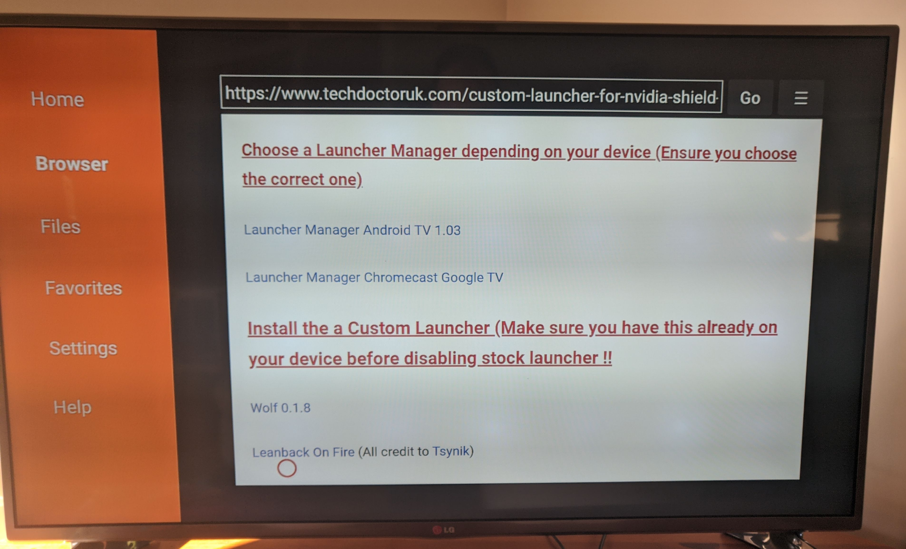

Have you received an update for your Nvidia Shield and been treated to this:

<figure>

<figcaption>A nice full screen ad.</figcaption>
</figure>

Or maybe this:

<figure>

<figcaption>Gross</figcaption>
</figure>

Look, It's only a small thing, and I'm being pedantic. But I still find them annoying on a device that cost over $300AUD.

Let's remove the ads from our launcher by replacing it with a custom launcher.
This should also work on other Android Tv boxes. Tested on an Nvidia Shield and a Xiaomi Mi Box 4
Hang around till the end to remove ads from another service too.

### Install Downloader
First, start by going to the play store on your Android TV device and search for **Downloader**
Give the app a download.

<figure>

<figcaption>Downloader in the playstore</figcaption>
</figure>

### Change some settings
Head back to the home screen and click the settings cog in the top right hand corner

```settings > device preferences >``` 

```security and restrictions```

Untick verify apps
and allow the **Downloader** app in **Unknown Sources**

Hit the back button to go back to **Device Preferences**
Go to the very top of that menu and click the **About** button

Have a look in the **About** section for **Build Information** and select it.
Now Hit ok or enter on the **Build Information** until you get the message **You're now a developer!**

Hit the back button again to go back to **Device Preferences** and you should have a new entry called **Developer**.
Open up **Developer** and scroll down til you see **Enable Wi-Fi Debugging**
(note if you only have the option for **USB Debugging** you can enable that instead).

### Install the browser for Downloader
We're ready to get everything installed now. Click the home button and open the **Downloader** app we installed earlier.
Once you're in the downloader app, search for **browser.aftvnews.com** and install the package. This will allow us to use the app's inbuilt browser.
Next in the search box, type in **80650** and this will take us to a page with two packages we need to download.
You'll need to scroll for some time down the page until you reach this point

<figure>

<figcaption>Downloading Wolf launcher and launcher manager</figcaption>
</figure>

### Install Wolf Launcher and Launcher Manager
From here you can download **Launcher Manager Android TV**. Click the link to download it, then install it.
(Note when you're prompted to delete the app after you download it, you can go ahead and delete the apk. These Android TV devices have pretty limited internal storage).
Next, download the **Wolf Launcher** and install it from the same page.

### Enable Wolf Launcher and customise
Hit the home button again and open up the **Launcher Manager** and select the option **Enable Custom Launcher**.
Once it's finished, you can click the home button, and you'll be prompted to select your default browser. Select **Wolf Launcher**.

You'll now be greeted with a pretty sparse looking home screen. However, ads are gone now! Let's make the home screen look a little more pretty. Head back into the **Downloader** app and search for something like **wallpaper download**. Browse a little until you find a wallpaper you like and download it (make sure you don't delete the img this time round).

Hit the home button again. Scroll all the way to the top of the home screen, and double-click the ok button. Now go to:

```launcher settings > wallpaper```

From here we can set our wallpaper (note the wallpaper is in the **Downloader** folder)

Head back to the home screen and scroll all the way to the top. Now double-click the enter or ok button on your remote.

```launcher settings > sections >``` 

```manage sections```

Add a new section called **Streaming** (or whatever takes your fancy) and move that section in between widgets and your applications.
Jump back to the home screen. Find some apps you use regularly, like Netflix or Plex for example, and hold the home button while hovering over them. Now click **Add to section** and add whatever apps you like to this section. Now all your favourite apps will be right at the top of the home screen.

Let's keep making the home screen look a bit nicer. We'll download a weather widget.
Open up the Play Store and download a weather app that includes a weather widget. I grabbed this one.

<figure>

<figcaption>Weather app</figcaption>
</figure>

Go back to your home screen, scroll all the way to the top, and hold the home button again. Now select **Pick Widget** and pick the 4x2 widget if you downloaded the same weather app as I did, or select the widget from your own weather app.

Now you should have a nice clean home screen, something that looks like this:

<figure>

<figcaption>That's better, nice and clean</figcaption>
</figure>

# BONUS
Would you like to remove ads from YouTube as well? Stick around!
Open up the **Downloader** app, and enter **is.gd/stnbeta** and install the application **STube**.
Add the app to your **Streaming** widget.

Done! You've now got no ads on YouTube too!
It's a little effort, but you should have a simpler Android TV experience.


