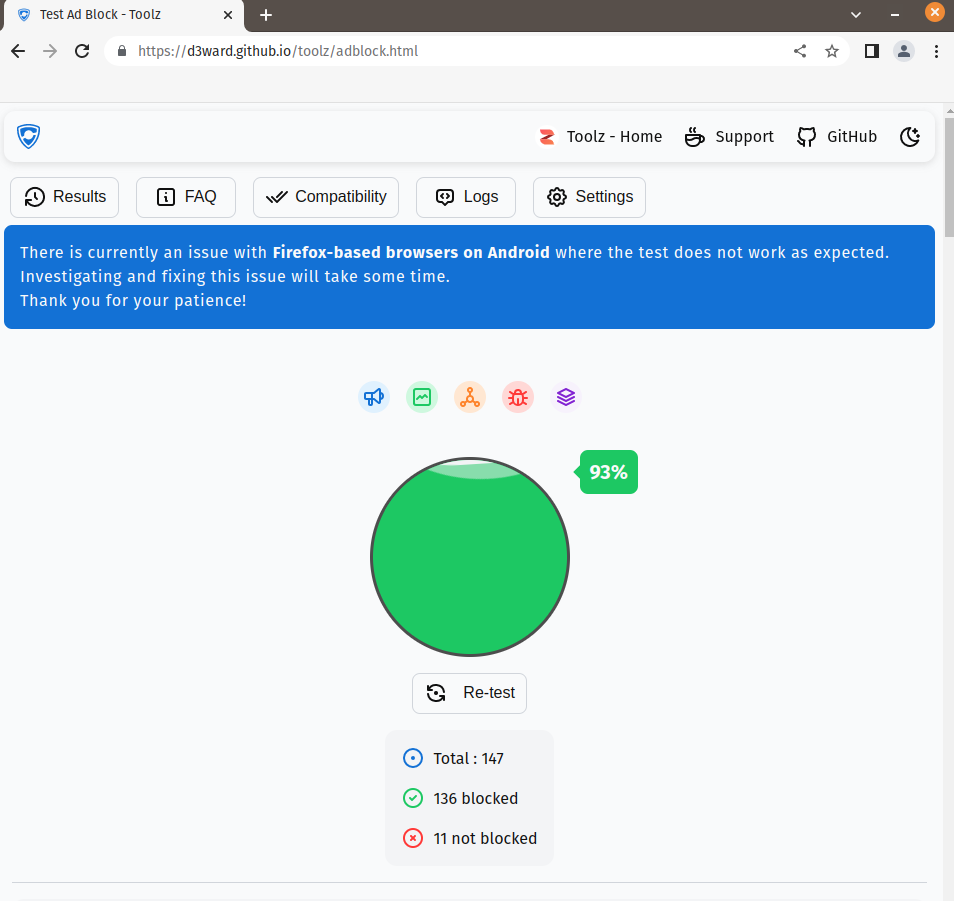
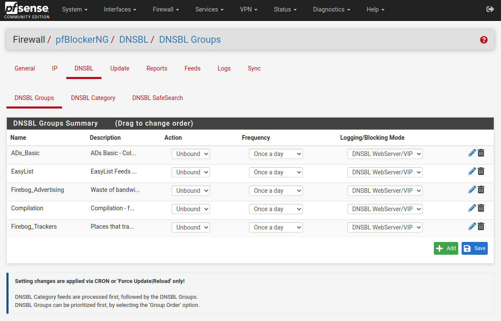

In the past, I've played around with custom router firmware such as [DD-WRT](https://dd-wrt.com/openwrt) and [OpenWrt](https://openwrt.org/). My main objective is usually to tunnel all my traffic through a VPN, and to do some ad blocking at the network level. Both of these projects are great, with OpenWrt giving me the most success at home. 
Now I've gone one step further, and I've purchased a [Protectli Vault](https://protectli.com/vault-4-port/), a purpose built firewall appliance that has great support for pfSense out of the box.

pfSense is a "firewall/router computer software distribution based on FreeBSD".
But more importantly, there are heaps of tutorials, there's a great package manager, and frequent updates.

So throw out your old and [probably vulnerable](https://www.securityweek.com/botenago-malware-targets-routers-iot-devices-over-30-exploits/) ISP provided router, buy/build a computer capable of running pfSense, and follow along!

# Installation
* Download the pfSense ISO file from here: <https://www.pfsense.org/download/>
* If you don't already have a bootable USB, I highly recommend you checkout [Ventoy!](https://www.ventoy.net/en/index.html) 
* Then follow along with the installation guide here: <https://www.pfsense.org/download/>
* I didn't change anything during the installation guide. The only thing I selected was my installation media. Everything else was left as the default.

# First boot
During the first boot, I made a few changes. Navigate to `192.168.1.1`
* When you're offered to configure DNS settings, leave the DNS server fields blank, and deselect the `Override DNS` option
* When asked to input a `LAN IP`, change it from the default to something in the private range, like `10.27.27.1`. This [isn't really for security](https://superuser.com/questions/1326971/for-security-reasons-should-the-default-ip-address-of-a-router-be-changed), but may help if you decide to VPN multiple networks together in the future.

As we've changed the LAN IP, you'll need to reset your device's IP address in order to be allocated a new one. 

On `linux` run: `sudo dhclient -r` then `sudo dhclient`

On `Windows` run: `ipconfig /release` then `ipconfig /renew`

If you're still having trouble connecting, you can also reboot your PC

# Thermals, DNS and Adblocking Setup
Head over to Ixonae's guide and follow these three parts:
* [Protectli Specific Configuration](https://www.ixonae.com/protect-your-home-network-with-pfsense-simple-walk-through/#protectli-specific-configuration)
* [DNS Resolver](https://www.ixonae.com/protect-your-home-network-with-pfsense-simple-walk-through/#dns-resolver). Follow the first part, ignore the second part with encrypted DNS through Cloudflare and Quad9
* [pfBlockerNG](https://www.ixonae.com/protect-your-home-network-with-pfsense-simple-walk-through/#pfblockerng)

# Check Internet and Adblocking
Once you've setup DNS and pfBlocker, open up Chrome or Firefox, disable your ad blocker, and go to an ad-infested website such as:
* https://www.dailymail.co.uk/ushome/index.html 
* https://www.theage.com.au/ 

If you see no ads, great! You've followed the steps correctly. If you're still seeing ads, double check you followed the steps from before correctly, and make sure you're not using a third party DNS within Chrome or Firefox.

# VPN With Mullvad
This section will only focus on `Mullvad`, however, there are heaps of other tutorials for other VPN providers, and you can probably substitute your own VPN provider's instructions here.
* Head to https://mullvad.net/en/help/using-pfsense-mullvad/ for Mullvad's official OpenVPN pfSense installation instructions
* We need to make one change. In step 7 of  Add a VPN connection, use port `1400` rather than `1301`. This will stop mullvad's [DNS hijacking](https://mullvad.net/en/help/faq/#39) and allow us to use pfBlocker.

# Check VPN
* Go to `Status/OpenVPN` and hit the little restart icon next to our OpenVPN Mullvad instance.
* If everything has worked correctly, adblocking should still be working!
* Use Mullvads tool to check your VPN connection here: https://mullvad.net/en/check 
* Mullvad should be happy with your VPN IP address, but will probably be show that your `Leaking DNS Servers`. With our DNS setup, we're using pfSense's [DNS Resolver](https://docs.netgate.com/pfsense/en/latest/services/dns/resolver-modes.html) which is contacting root DNS servers on our behalf. As long as the IP address in the DNS section of Mullvad's test, matches the VPN IP reported in the test, I believe this is OK. As all our DNS queries originate from the Mullvad OpenVPN connection.
* Double check with [dnsleaktest](https://www.dnsleaktest.com/results.html) just to be sure

# Testing PFBlocker
Open up a Firefox or Chrome tab, disable any ad blocking add-ons, and head to <https://d3ward.github.io/toolz/adblock.html>
This website tests our ad blocker with a buffet of different advertisers, trackers, and analytics domains. Out of the box, I was scoring around ~40ish percent, but made some changes to eventually score 93%.
- In `EasyList`, I only enabled `EasyList`, and `EasyPrivacy`
- In `Firebog Advertising`, I enabled `Adguard_DNS` and `PL_Adservers`
- All other `DNSBL groups` seen below had all their feeds enabled.

<figure>

<figcaption>Test results after adding additional feeds</figcaption>
</figure>

<figure>

<figcaption>I used these DNSBL groups</figcaption>
</figure>

With such a high scoring result on this one ad block testing website, does this mean I'll never see an ad again, and I'll never be tracked again? Right??

No.

However, It's another layer to add to your network to gain additional privacy and security.

Play around with different combinations of block lists. Do a quick Google, and see what other people are using. By no means Is my configuration 'the best'. I highly recommend experimenting and seeing what works for you.
To start adding new feeds, head to the feeds tab in pfBlocker, and click the little + icon next to the group you're looking at adding. Some groups contain only a single feed, while others contain a dozen different feeds.

# Intrusion detection with SNORT
Finally, if you're still keen to experiment with pfSense, you can also enable SNORT. SNORT is an intrusion detection and prevention program that actively monitors your network.

Head over to Ixonae's guide and follow the SNORT section: <https://www.ixonae.com/protect-your-home-network-with-pfsense-simple-walk-through/#snort>

There's still some more to do. I want to add a [backup VPN](https://www.ixonae.com/home-network-and-pfsense-improvements/) in case the primary VPN goes down, and need to do some port-forwarding and split-tunnel configuration to allow clients to access the internet from outside. Maybe some Tailscale exit-node shenanigans at some stage too...